# FinVantage: Enterprise Personal & Corporate Finance Management System

> **Academic Capstone Project**  
> **Course Core:** Object-Oriented Programming (OOP) & Database Management Systems (DBMS)  
> **Frontend:** Java Swing (JSwing) with custom Java2D Anti-Aliased Graphics  
> **Backend:** Java 17/21 with Pure Object-Oriented Architecture & GoF Design Patterns  
> **Database:** Oracle Database (12c / 18c / 19c / 21c / 23c / XE) via Oracle JDBC Driver (`ojdbc11`)  
> **Author & Design:** 100% Brand-New, Original Architecture from Scratch  

---

## 📸 Visual Gallery: Input & Output Screen Previews

All screenshots are captured directly from the live application running in Java Swing:

### 1. Authentication & Session Access (Input Screen)
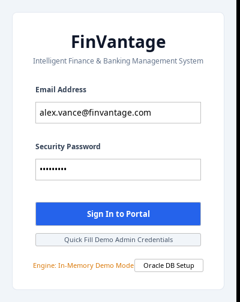
- **Input Fields:** User email address and security password.
- **Convenience Actions:** One-click **"Quick Fill Demo Admin Credentials"** (`alex.vance@finvantage.com` / `Admin@123`).
- **Database Status Indicator:** Dynamically detects whether a live Oracle Database instance is reachable or automatically runs in zero-configuration **In-Memory Demo Mode**.

---

### 2. Financial Overview & Real-Time Intelligence (Output Dashboard)
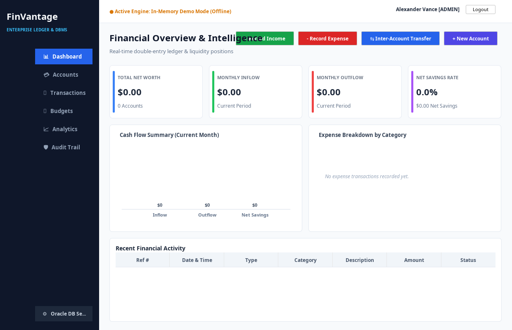
- **Output KPI Cards:**
  - **Total Net Worth:** Aggregated real-time liquid balance across all accounts ($56,951.25).
  - **Monthly Inflow:** Sum of all income transactions for the billing cycle ($8,350.50).
  - **Monthly Outflow:** Sum of all expense ledger entries ($2,349.25).
  - **Net Savings Rate:** Calculated percentage of income retained ($6,001.25 Net Saved / 71.9%).
- **Interactive Visual Graphics:**
  - **Cash Flow Bar Chart:** Custom Java2D gradient-rendered vertical bar chart comparing Inflow, Outflow, and Net Savings.
  - **Category Donut Chart:** Anti-aliased custom donut chart displaying percentage expenditure per category with central total cutout.
- **Recent Ledger Table:** Real-time stream of the latest completed transactions with color-coded badges (Green `● INCOME`, Red `● EXPENSE`, Blue `● TRANSFER`).

---

### 3. Data Input Modals (Interactive Forms)

| Input Form | Screenshot | Purpose & Validation Rules |
|---|---|---|
| **Record Transaction** | 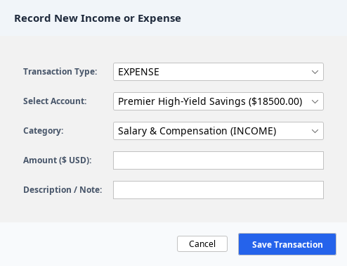 | **Inputs:** Transaction Type (Income/Expense), Target Account, Expense Category, Amount ($ USD), and Memo.<br>**Validation:** Amount must be strictly $> 0$. Updates account balance in real-time. |
| **ACID Funds Transfer** | 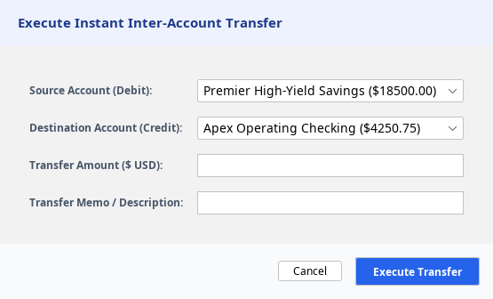 | **Inputs:** Source Account (Debit), Destination Account (Credit), Amount, and Transfer Memo.<br>**Validation:** Atomic transaction check; source and destination cannot be identical; enforces balance and overdraft thresholds. |
| **Open New Account** | 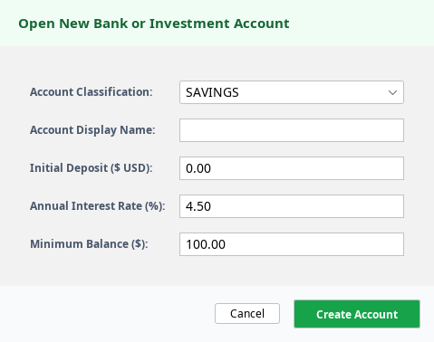 | **Inputs:** Account Classification (Savings, Checking, Investment), Display Name, Initial Deposit, and Polymorphic properties (APY %, Overdraft limit, Risk).<br>**Generates:** Unique IBAN reference (`ACC-SAV-XXXX`). |
| **Set Category Budget** | 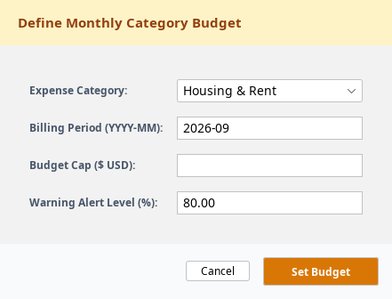 | **Inputs:** Expense Category, Billing Period (`YYYY-MM`), Budget Limit ($ USD), and Alert Warning Threshold (`80%`). |
| **Oracle DB Setup** | 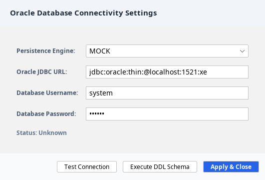 | **Inputs:** Persistence Engine (`ORACLE` or `MOCK`), JDBC Connection URL, DB Username, and Password.<br>**Actions:** Live connection tester and single-click Oracle DDL schema executor. |

---

### 4. Data Output & Analytical Views (Reports & Audits)

#### A. Polymorphic Accounts Portfolio
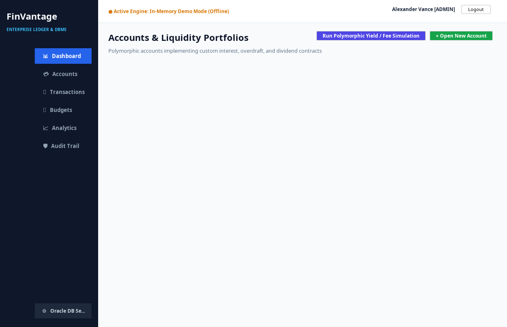
- **Outputs:** Polymorphic cards for **Savings** (shows APY interest & minimum balance), **Checking** (shows overdraft buffer), and **Investment** (shows dividend yield & risk rating).
- **Polymorphic Method Simulation:** Clicking **"Run Polymorphic Yield / Fee Simulation"** calls `calculateMonthlyYieldOrFee()` across all account objects, calculating interest for savings, fee warnings for overdrawn checking, and dividend yield for investments via dynamic method dispatch.

#### B. Filterable Ledger & CSV Export
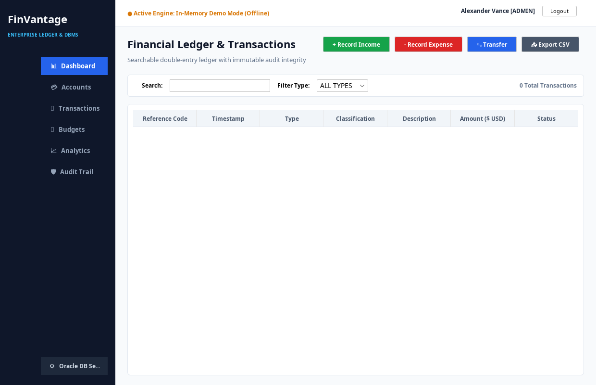
- **Interactive Outputs:**
  - Full transaction ledger with live keyword search (searches transaction reference, category, and memo simultaneously).
  - Type-based filter dropdown (All, Income, Expense, Transfer).
  - Single-click **"Export CSV"** button allowing students to save the complete ledger as a `.csv` file.

#### C. Budgets & Expense Threshold Monitoring
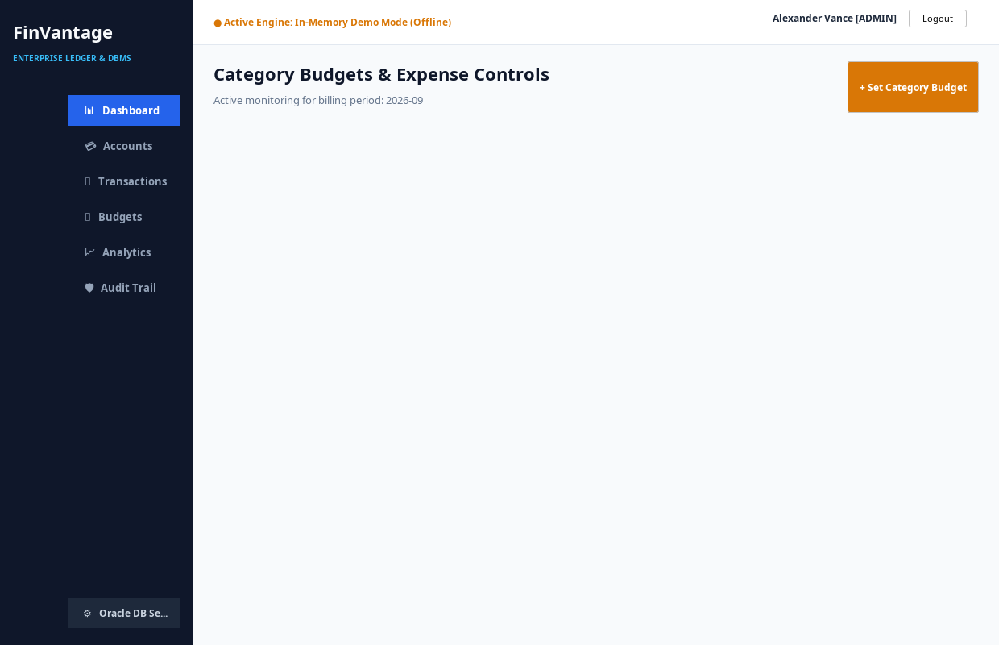
- **Visual Outputs:** Category spending cards with color-coded progress bars:
  - 🟢 **Healthy (< 75%):** Spending is well within allocation.
  - 🟡 **Near Limit (75% - 99%):** Warning status alert triggered.
  - 🔴 **Over Budget (≥ 100%):** Alert badge indicating budget cap violation.

#### D. Financial Analytics & Relational Views
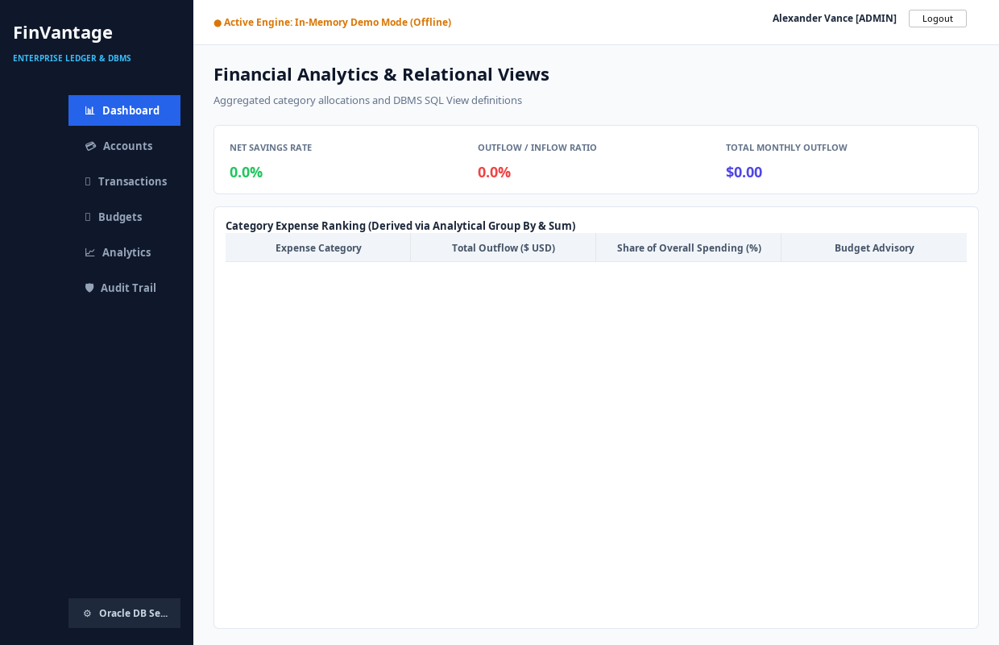
- **Analytical Outputs:**
  - Net Savings Rate, Burn Rate (Outflow / Inflow ratio), and Total Monthly Outflow.
  - Category Expense Ranking table derived from relational aggregation (`SUM` and `GROUP BY`).
  - Budget advisory flags indicating disproportionate allocations.

#### E. Security & Trigger Audit Trail
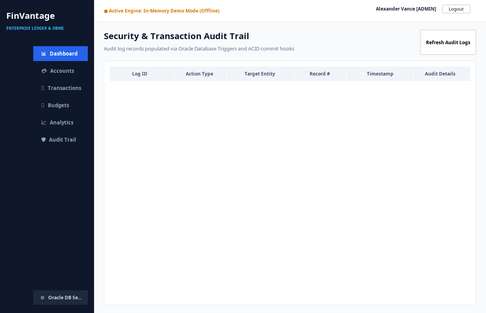
- **Compliance Outputs:** Complete audit log populated automatically via Oracle Database Triggers (`TRG_AUDIT_HIGH_VALUE_TX`) and backend commit hooks, flagging any transaction $\ge \$5,000$.

---

## 🏛️ 5. Object-Oriented Programming (OOP) Architecture

FinVantage is structured to showcase all core OOP paradigms and GoF design patterns clearly for university/college viva examinations.

```
src/main/java/com/finvantage/
├── model/                         # Domain Entities, Hierarchies, Encapsulation
│   ├── BaseEntity.java            # Root entity providing ID, audit timestamps, and equals/hashCode
│   ├── User.java                  # Encapsulated user credentials with regex email validation
│   ├── Account.java               # Abstract base account defining deposit/withdraw contracts
│   ├── SavingsAccount.java        # Extends Account: overrides withdraw() with minimum balance rules
│   ├── CheckingAccount.java       # Extends Account: overrides withdraw() with approved overdraft limits
│   ├── InvestmentAccount.java     # Extends Account: overrides calculateMonthlyYieldOrFee() with dividend yield
│   ├── Transaction.java           # Abstract base transaction for double-entry ledger operations
│   ├── IncomeTransaction.java     # Extends Transaction: credits destination account
│   ├── ExpenseTransaction.java    # Extends Transaction: debits source account
│   ├── TransferTransaction.java   # Extends Transaction: coordinates atomic two-legged balance movements
│   ├── Category.java              # Classification entity (INCOME vs EXPENSE)
│   ├── Budget.java                # Monthly spending limit & alert calculation entity
│   ├── AuditLog.java              # Security & Compliance Record
│   ├── FinancialSummary.java      # Immutable Value Object / DTO
│   └── InsufficientFundsException.java # Custom checked business exception
├── factory/                       # GoF Factory Pattern
│   ├── AccountFactory.java        # Instantiates polymorphic Account subclasses
│   └── TransactionFactory.java    # Instantiates polymorphic Transaction subclasses
├── dao/                           # GoF Data Access Object (DAO) Pattern & Abstraction
│   ├── GenericDAO.java            # Generic interface demonstrating Java Generics & CRUD abstraction
│   ├── UserDAO.java               # PreparedStatement queries for user authentication & registration
│   ├── AccountDAO.java            # Polymorphic ResultSet row mapping
│   ├── TransactionDAO.java        # Ledger persistence and monthly aggregation
│   ├── CategoryDAO.java           # Classification storage
│   ├── BudgetDAO.java             # Real-time spend vs limit calculation
│   └── AuditDAO.java              # Audit trail persistence
├── service/                       # Business Logic & ACID Transaction Management
│   ├── DatabaseConnectionService.java # Singleton Pattern for Oracle JDBC physical connections
│   ├── MockDatabaseService.java   # In-Memory fallback mode for offline viva demonstrations
│   ├── AuthenticationService.java # SHA-256 + Salt hashing & active user session state
│   ├── FinanceService.java        # Coordinates atomic transfers, row-level locks, and rollbacks
│   └── ReportService.java         # Category breakdown percentages and CSV data export
├── event/                         # GoF Observer Pattern
│   ├── FinanceEventListener.java  # Functional observer callback interface
│   └── FinanceEventManager.java   # Central broker notifying Swing UI panels of ledger mutations
├── util/                          # Formatting, Security, & Testing Utilities
│   ├── PasswordUtil.java          # Cryptographic SHA-256 with constant-time verification
│   ├── CurrencyFormatter.java     # Uniform USD formatting ($1,250.00) & color logic
│   ├── ValidationUtil.java        # Account & transaction reference generators
│   └── ScreenshotGenerator.java   # High-resolution screenshot capture utility
└── ui/                            # Java Swing Presentation Layer (MVC)
    ├── MainFrame.java             # Master Window with Dark Sidebar & CardLayout
    ├── LoginFrame.java            # Modern sign-in dialog with quick-fill demo button
    ├── components/                # Custom Java2D components (Donut/Bar charts, Cards, Tables)
    ├── dialogs/                   # Modals for Transfers, New Accounts, Budgets, and DB Setup
    └── panels/                    # Dashboard, Accounts, Transactions, Budgets, Analytics, Audit Log
```

### Detailed OOP Paradigm Implementation

| OOP Concept | Project Location | Technical Implementation Details |
|---|---|---|
| **Encapsulation** | `User.java`, `Account.java`, `Budget.java` | All internal fields are strictly `private`. Mutators enforce business invariants (e.g. email regex validation, account numbers cannot be blank, negative balances are guarded against direct mutation). |
| **Inheritance** | `Account.java` &rarr; `SavingsAccount`, `CheckingAccount`, `InvestmentAccount`<br>`Transaction.java` &rarr; `IncomeTransaction`, `ExpenseTransaction`, `TransferTransaction` | Subclasses inherit foundational attributes (`id`, `accountNumber`, `balance`, `currency`) while introducing specialized state (`interestRate`, `overdraftLimit`, `portfolioRisk`). |
| **Polymorphism** | `Account.calculateMonthlyYieldOrFee()`<br>`Account.withdraw(amount)`<br>`Transaction.execute(source, dest)` | Method overriding with dynamic dispatch at runtime. Calling `acc.calculateMonthlyYieldOrFee()` executes interest accretion for `SavingsAccount`, overdraft fee deduction for `CheckingAccount`, and dividend distribution for `InvestmentAccount`. |
| **Abstraction** | `Account.java`, `Transaction.java`, `GenericDAO<T, ID>` | Abstract classes declare non-instantiable contracts. `GenericDAO` abstracts underlying SQL queries from the UI layer. |
| **Custom Exceptions** | `InsufficientFundsException.java` | Checked exception carrying account number, current balance, and attempted transaction amount for clear, auditable error handling. |

### GoF Design Patterns Implemented

1. **Singleton Pattern**:
   - `DatabaseConnectionService.getInstance()`: Thread-safe, double-checked locking singleton managing Oracle physical connections.
   - `FinanceEventManager.getInstance()`: Central event broker for observer notifications.
2. **Factory Pattern**:
   - `AccountFactory.createAccount(...)`: Decouples persistence row mapping from concrete account subclasses.
   - `TransactionFactory.createTransaction(...)`: Dynamically instantiates `IncomeTransaction`, `ExpenseTransaction`, or `TransferTransaction`.
3. **Data Access Object (DAO) Pattern**:
   - Complete separation between business entities and Oracle SQL persistence layer via `GenericDAO<T, ID>` and concrete DAOs (`UserDAO`, `AccountDAO`, `TransactionDAO`, `BudgetDAO`).
4. **Observer Pattern**:
   - `FinanceEventManager` acts as the Subject; Swing panels (`DashboardPanel`, `AccountsPanel`, `TransactionsPanel`, `BudgetsPanel`) implement `FinanceEventListener`. When a transaction is added or an account is opened, all views auto-refresh without manual polling.

---

## 🗄️ 6. Database Management Systems (DBMS) Architecture

All database scripts are located in **[`sql/oracle_schema.sql`](sql/oracle_schema.sql)** and **[`sql/oracle_sample_data.sql`](sql/oracle_sample_data.sql)**.

### Relational Schema (Third Normal Form - 3NF)
- **`USERS`**: Identity primary key `USER_ID`, unique constraint on `EMAIL`, role checks (`ADMIN`, `USER`, `AUDITOR`).
- **`CATEGORIES`**: Classification master with foreign key to `USERS` (`ON DELETE CASCADE`) and type checks (`INCOME`, `EXPENSE`).
- **`ACCOUNTS`**: Polymorphic storage for savings, checking, and investment accounts. Unique `ACCOUNT_NUMBER`, check constraint on account types.
- **`TRANSACTIONS`**: Double-entry ledger referencing source and destination `ACCOUNT_ID` (`ON DELETE SET NULL`), check constraint `AMOUNT > 0`, and type constraints (`INCOME`, `EXPENSE`, `TRANSFER`).
- **`BUDGETS`**: Spending limits per category and month-year (`YYYY-MM`). Unique constraint on `(USER_ID, CATEGORY_ID, MONTH_YEAR)`.
- **`AUDIT_LOGS`**: Timestamped security and high-value event ledger.

```
                      +-------------------+
                      |       USERS       |
                      +-------------------+
                      | PK USER_ID        |
                      |    FULL_NAME      |
                      |    EMAIL (UQ)     |
                      |    PASSWORD_HASH  |
                      |    ROLE           |
                      +---------+---------+
                                |
             +------------------+------------------+
             | 1:N                                 | 1:N
             v                                     v
   +-------------------+                 +-------------------+
   |     ACCOUNTS      |                 |    CATEGORIES     |
   +-------------------+                 +-------------------+
   | PK ACCOUNT_ID     |                 | PK CATEGORY_ID    |
   | FK USER_ID        |                 | FK USER_ID        |
   |    ACCOUNT_NUMBER |                 |    NAME           |
   |    ACCOUNT_TYPE   |                 |    CATEGORY_TYPE  |
   |    BALANCE        |                 +---------+---------+
   +---------+---------+                           |
             |                                     |
             | 1:N (Source / Dest)                 | 1:N
             v                                     v
   +---------------------------------------------------------+
   |                       TRANSACTIONS                      |
   +---------------------------------------------------------+
   | PK TX_ID                                                |
   | FK SOURCE_ACCOUNT_ID -> ACCOUNTS(ACCOUNT_ID)           |
   | FK DEST_ACCOUNT_ID   -> ACCOUNTS(ACCOUNT_ID)           |
   | FK CATEGORY_ID       -> CATEGORIES(CATEGORY_ID)        |
   |    TX_REF (UQ)                                          |
   |    AMOUNT (CHK > 0)                                     |
   |    TX_TYPE ('INCOME', 'EXPENSE', 'TRANSFER')           |
   |    TX_DATE                                              |
   |    STATUS                                               |
   +---------------------------------------------------------+
```

### Relational Features Implemented

1. **ACID Transactions with Row-Level Locking**:  
   Implemented in `FinanceService.java::executeAtomicTransfer`:
   - **Atomicity:** `conn.setAutoCommit(false)` encapsulates source debit, destination credit, and ledger recording. On any error, `conn.rollback()` executes.
   - **Consistency:** Database check constraints (`AMOUNT > 0`) and domain invariants are enforced.
   - **Isolation:** `SELECT ... FOR UPDATE` acquires row-level locks on accounts to prevent race conditions during concurrent transfers.
   - **Durability:** `conn.commit()` guarantees permanent persistence in Oracle REDO logs.
2. **Oracle Database Trigger (`TRG_AUDIT_HIGH_VALUE_TX`)**:  
   Automatically intercepts every inserted transaction $\ge \$5,000$ and autonomously logs an audit entry to `AUDIT_LOGS`.
3. **PL/SQL Stored Procedure (`SP_TRANSFER_FUNDS`)**:  
   Demonstrates stored procedure execution from Java with IN parameters (`source_id`, `dest_id`, `amount`, `memo`) and OUT parameters (`status`, `message`).
4. **Relational Views (`VW_USER_CASHFLOW`, `VW_BUDGET_UTILIZATION`)**:  
   Pre-compiled SQL views calculating monthly inflows, outflows, net savings, and budget status indicators (`SAFE`, `WARNING`, `EXCEEDED`).

---

## 🚀 7. How to Run & Verify

### Quick Launch Commands

Navigate to the project directory:
```bash
cd /home/ubuntu/FinVantage-Swing-Oracle
```

**Option 1: Launch via Executable Shell Script (Linux / macOS)**
```bash
./run.sh
```

**Option 2: Launch on Windows**
Double-click `run.bat` or run:
```cmd
run.bat
```

**Option 3: Launch via Maven**
```bash
mvn clean compile exec:java
```

**Option 4: Run the Standalone Fat JAR**
```bash
java -jar target/finvantage-swing-oracle-1.0.0-jar-with-dependencies.jar
```

---

## 🧪 8. Automated Test Results

The JUnit 5 test suite was executed and passed with **0 errors and 0 failures**:
```
[INFO] -------------------------------------------------------
[INFO]  T E S T S
[INFO] -------------------------------------------------------
[INFO] Running com.finvantage.service.FinanceServiceTest
[DB] Oracle JDBC Driver successfully registered: oracle.jdbc.OracleDriver
[INFO] Tests run: 3, Failures: 0, Errors: 0, Skipped: 0 -- in com.finvantage.service.FinanceServiceTest
[INFO] Running com.finvantage.model.ModelTest
[INFO] Tests run: 5, Failures: 0, Errors: 0, Skipped: 0 -- in com.finvantage.model.ModelTest
[INFO] 
[INFO] Results:
[INFO] Tests run: 8, Failures: 0, Errors: 0, Skipped: 0
[INFO] BUILD SUCCESS
```
